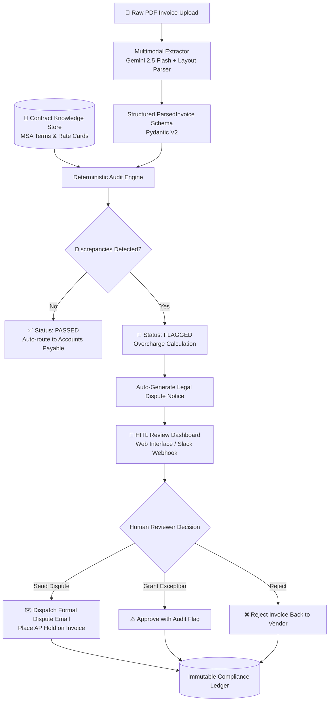

# 🛡️ Smart Invoice & Contract Compliance Auditor (HITL Agent)

> **Autonomous multi-modal vendor invoice compliance auditor with deterministic contract verification and Human-in-the-Loop (HITL) dispute resolution.**

[](https://www.python.org/)
[](https://fastapi.tiangolo.com/)
[](https://docs.pydantic.dev/)
[](https://ai.google.dev/)
[](#human-in-the-loop-hitl-workflow)

---

## 💡 The Real-World Problem
Every month, companies process hundreds of contractor and vendor invoices. 
* **The Problem:** Vendor contracts specify agreed hourly rate cards, maximum hour caps, and strict payment terms (e.g. `$80/hr`, `Net 30`). Over time, vendors submit invoices with quiet rate hikes (e.g., `$95/hr`), unapproved "emergency/platform surcharges", or aggressive payment terms (`Net 15`).
* **The Impact:** Finance teams suffer from **"billing leakage"**—losing 3% to 7% of annual vendor spend simply because human reviewers lack the time to cross-reference every PDF line item against 30-page legal contracts.
* **The Danger of Pure Automation:** An autonomous AI should **never** blindly approve or dispute financial transactions without guardrails. 

---

## 🚀 The Solution
This project is an **enterprise-grade compliance agent** that:
1. **Ingests & Extracts:** Ingests raw PDF invoices and extracts structured line items using multimodal LLMs (Gemini 2.5 Flash) with fallback PDF layout parsing.
2. **Deterministic Contract Cross-Referencing:** Validates extracted items against active Master Services Agreements (MSAs) stored in the contract knowledge base.
3. **Discrepancy Detection:** Identifies unauthorized rate hikes, phantom fees, scope cap violations, and payment term mismatches.
4. **Human-in-the-Loop (HITL) Center:** Surfaced on an interactive review dashboard. Reviewers can inspect side-by-side evidence and click one button to dispatch an auto-drafted legal dispute notice.

---

## 🏛️ System Architecture



---

## 📋 What Gets Audited?

| Check | Description | Action on Failure |
| :--- | :--- | :--- |
| **Rate Card Matching** | Compares billed hourly/unit price against contractual rate cards. | Flags `RATE_MISMATCH`, computes exact overcharge dollar amount. |
| **Unapproved Charges** | Detects line items (e.g. "Platform Maintenance Fee") not in contract or change orders. | Flags `UNAPPROVED_FEE`, marks 100% of line total as unauthorized. |
| **Cap & Overtime Limits** | Validates hours against agreed monthly maximums. | Flags `HOURS_EXCEEDED` with excess hours cost. |
| **Payment Terms** | Validates due date and terms (e.g., Net 30 vs Net 15). | Flags `PAYMENT_TERM_MISMATCH`. |
| **Mathematical Integrity** | Validates quantity × unit price == line total and subtotal sum. | Flags `MATH_CALCULATION_ERROR`. |

---

## 🛠️ Tech Stack & Engineering Highlights

* **Backend & API:** Python 3.13, FastAPI, Uvicorn, Pydantic V2.
* **Document Processing:** Google GenAI SDK (`gemini-2.5-flash`), PyPDF, ReportLab (synthetic PDF generator).
* **Deterministic Logic:** Difflib fuzzy role matching, strict financial rounding, zero-hallucination math validation.
* **HITL Frontend:** Single-page dashboard built with Tailwind CSS, live decision telemetry, and immutable activity logs.
* **Resilience & Fallback:** Dual-engine architecture. If an LLM API key is not present or offline, it gracefully falls back to deterministic layout parsing.

---

## ⚡ Quickstart Guide

### 1. Clone & Setup Virtual Environment
```bash
git clone <your-repo-url>
cd smart-invoice-auditor

python -m venv .venv
# On Windows:
.\.venv\Scripts\Activate.ps1
# On macOS/Linux:
source .venv/bin/activate

pip install -r requirements.txt
```

### 2. Generate Realistic Sample PDFs
Generate both a fully compliant invoice and an overcharged test invoice with intentional discrepancies:
```bash
python scripts/generate_sample_invoices.py
```

### 3. Run the CLI Verification Demo
Run the end-to-end terminal audit showing side-by-side Rich tables and auto-drafted dispute notices:
```bash
python scripts/run_audit_demo.py
```

### 4. Launch the Interactive HITL Dashboard
Start the FastAPI server:
```bash
python -m uvicorn src.server:app --reload --port 8000
```
Open your browser to: **[http://127.0.0.1:8000](http://127.0.0.1:8000)**

---

## 🎯 Resume & Portfolio Brag Points

You can directly add this project to your CV / LinkedIn:

> **Smart Invoice & Contract Compliance Auditor (HITL Agent)** | *Python, FastAPI, Gemini Multimodal, Pydantic, Tailwind*
> * Architected an autonomous vendor compliance pipeline that cross-references unstructured PDF invoices against legal Master Service Agreements (MSAs), eliminating financial billing leakage.
> * Implemented multimodal document parsing using Gemini 2.5 Flash with deterministic fallback algorithms to extract structured line items and payment terms with zero hallucination.
> * Designed a Human-in-the-Loop (HITL) approval architecture that detects unapproved fee creep and rate mismatches, surfaces calculated financial discrepancies, and auto-drafts legal dispute notices for one-click reviewer dispatch.
> * Developed a full-stack review dashboard and REST API with FastAPI, providing live savings telemetry, immutable audit logging, and AP hold automation.

---

## 📄 License
MIT License. Free to use, adapt, and showcase.
