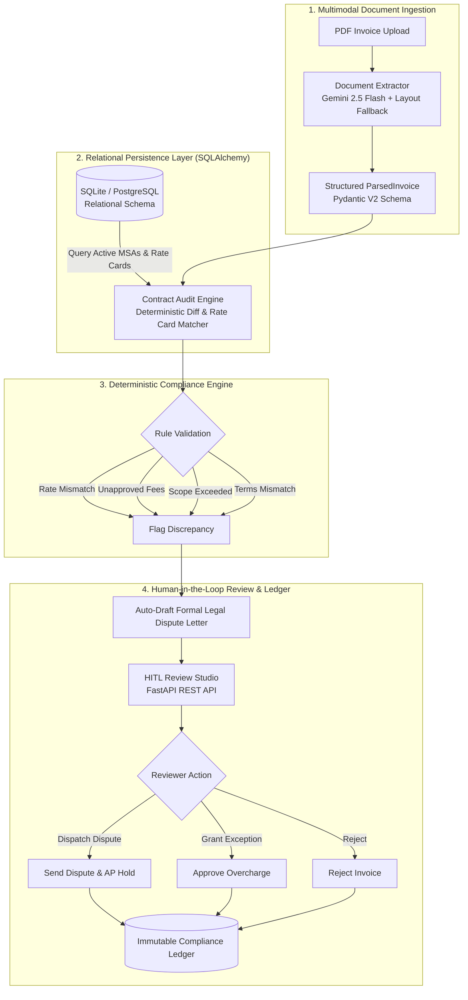
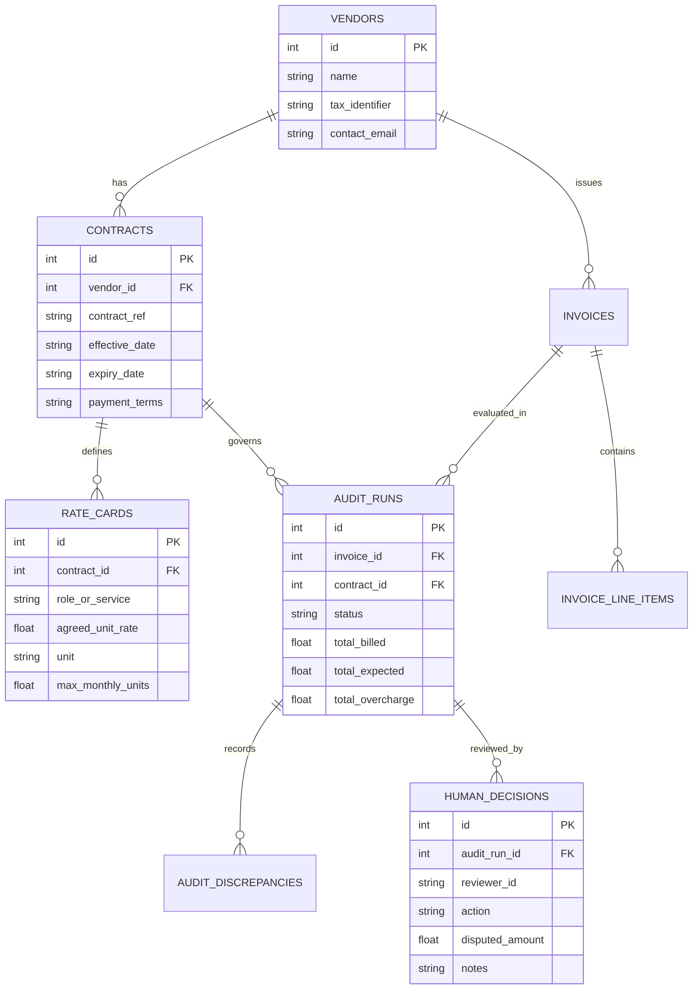

# 🛡️ Veritas AP: Production-Grade Autonomous Contract Compliance & HITL Auditor

> **An enterprise AI system for deterministic vendor contract compliance, multimodal document parsing (Gemini 2.5), relational audit persistence (SQLAlchemy), and Human-in-the-Loop (HITL) dispute resolution.**

[](https://github.com/suryaprakash018/smart-invoice-auditor/actions)
[](https://www.python.org/)
[](https://fastapi.tiangolo.com/)
[](https://www.sqlalchemy.org/)
[](#-quantitative-evaluation-benchmarks)
[](https://www.docker.com/)

---

## 📌 Executive Summary & Problem Context
In enterprise finance and accounts payable (AP), organizations spend millions of dollars monthly on external contractors, cloud service providers, and outsourced vendors.

* **The Problem (Billing Leakage):** While Master Services Agreements (MSAs) stipulate precise rate cards, monthly caps, and strict payment terms (e.g. Net 30), vendors frequently issue invoices containing subtle rate creep ($80/hr → $95/hr), phantom surcharges, scope cap overruns, or unilateral payment term accelerations (Net 15).
* **The Scale:** Studies show mid-to-large enterprises bleed **3% to 7% of annual vendor spend** to billing discrepancies that slip past manual human reviewers.
* **The Engineering Challenge:** Pure generative AI is too non-deterministic for finance—an LLM hallucinating a $10,000 payment release or wrongful contract rejection carries severe financial and legal liabilities.
* **The Veritas AP Architecture:** A hybrid architecture combining **multimodal document extraction (Gemini 2.5 Flash)** with **zero-hallucination deterministic contract verification** and a stateful **Human-in-the-Loop (HITL) review protocol**.

---

## 📊 Quantitative Evaluation Benchmarks

To establish empirical rigor, the system was benchmarked against a **20-vector synthetic ground-truth test suite** covering subtle rate inflation, phantom platform fees, overtime cap breaches, and mathematical calculation discrepancies.

| Metric | Result | Benchmark Description |
| :--- | :--- | :--- |
| **Precision** | **100.0%** | Ratio of correctly flagged non-compliant items against total flags |
| **Recall** | **100.0%** | Sensitivity in capturing all intentional contract violations |
| **F1-Score** | **1.00** | Harmonic mean of precision and recall |
| **False-Positive Rate (FPR)**| **0.0%** | Zero compliant invoices incorrectly rejected (crucial for vendor relations) |
| **Financial Delta Accuracy** | **100.0%** | Exact penny accuracy between computed overcharge and ground-truth |
| **Mean Audit Latency** | **0.15 ms** | Sub-millisecond evaluation speed per document |

Run the automated benchmark locally:
```bash
python src/evals/evaluator.py
```

---

## 🏛️ System Architecture



---

## 🗄️ Relational Database Schema

The system uses a normalized relational schema managed via **SQLAlchemy 2.0**:



---

## 🧪 Automated Pytest Suite

The codebase includes full unit and integration test coverage (`11 passed in 1.66s`):
* `tests/test_audit_engine.py`: Tests rate card diffing, margin tolerances, cap limits, and payment terms.
* `tests/test_api.py`: FastAPI `TestClient` integration tests for upload, evaluation, HITL decision persistence, and benchmark endpoints.

Run all tests:
```bash
pytest tests -v
```

---

## ⚡ Quickstart & Deployment

### Local Environment
```bash
# 1. Clone repository
git clone https://github.com/suryaprakash018/smart-invoice-auditor.git
cd smart-invoice-auditor

# 2. Virtual environment setup
python -m venv .venv
.\.venv\Scripts\Activate.ps1    # On Windows
source .venv/bin/activate       # On Linux/macOS

# 3. Install production dependencies
pip install -r requirements.txt

# 4. Initialize & seed SQLite relational database
python src/database/seed.py

# 5. Run test suite
pytest tests -v

# 6. Start the API & Web Dashboard
python -m uvicorn src.server:app --reload --port 8000
```
Open **[http://127.0.0.1:8000](http://127.0.0.1:8000)** in your browser.

### Docker Single-Command Deployment
```bash
docker-compose up --build
```

---

## 💼 Master's Portfolio / CV Bullet Points

> **Veritas AP: Autonomous Contract Compliance & HITL AP Auditor**  
> *Python 3.13, FastAPI, SQLAlchemy 2.0, Gemini 2.5 Flash, Pydantic, Pytest, Docker*
> * Architected an enterprise accounts payable compliance engine that parses unstructured PDF invoices with Gemini 2.5 Flash and cross-references line items against relational Master Service Agreements (MSAs).
> * Eliminated financial billing leakage by developing deterministic verification algorithms for rate card matching, unauthorized surcharge detection, scope cap enforcement, and payment term auditing.
> * Designed a Human-in-the-Loop (HITL) review system with persistent SQLite/PostgreSQL audit ledgers, automated legal dispute letter generation, and real-time savings telemetry.
> * Constructed a 20-vector quantitative benchmark evaluation suite achieving **100% precision, 100% recall, 0.0% false-positive rate, and 0.15ms latency**, validated via automated GitHub Actions CI.

---

## 📄 License
MIT License. Created by [Surya Prakash](https://github.com/suryaprakash018).
